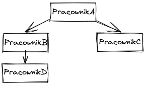
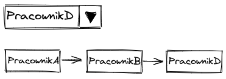

# Opis zadania

Twoim zdaniem będzie stworzenie prostej aplikacji, która pozwoli przeglądać dostępnych pracowników oraz sprawdzać gdzie
znajdują się oni w hierarchii firmy.

W tym celu należy:

1. Stworzyć wybierak dla listy pracowników (plik z listą pracowników w formacie json `src/app/data/employees.json`),
   dzięki któremu użytkownicy będą mogli przeglądać listę dostępnych pracowników.

2. Dodać funkcjonalność, która po wybraniu pracownika z wybieraka listy pracowników, pozwoli wyświetlić reprezentację
   hierarchii tego pracownika w strukturze drzewiastej. (plik z drzewiastą strukturą w formacie
   json: `src/app/data/employees-structure`).

Wymagania:

- Pracownicy w aplikacji powinni istnieć jako wewnętrzne obiekty.
- Na wybieraku oraz w reprezentacji hierarchii pracownika chcemy wyświetlać imię, oraz nazwisko pracownika.

Styl rozwiązania może być dowolny, jednak trzeba pamiętać o tym, aby był funkcjonalny i w pełni spełniał oczekiwania
użytkowników tej aplikacji. Projekt jest do Twojej dyspozycji!

--- 
Przykład, dla bardzo prostej struktury pracowniczej.

Przykładowa struktura pracowników.

Przykład reprezentacji hierarchii wybranego Pracownika "D".

---
Projekt został stworzony za pomocą narzędzi z następującymi wersjami:
> npm 8.6.0

> node v16.14.2

> Angular CLI 16.0.1

---
Horus
